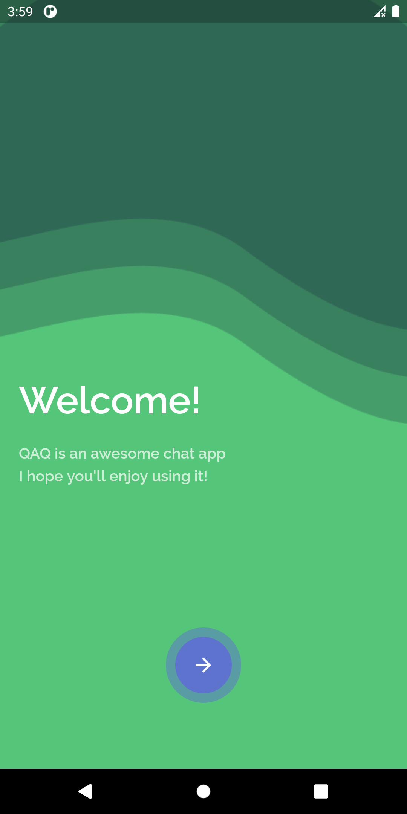
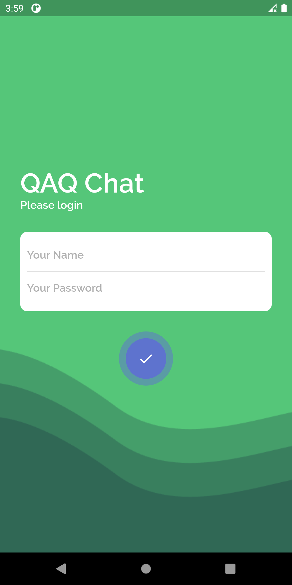
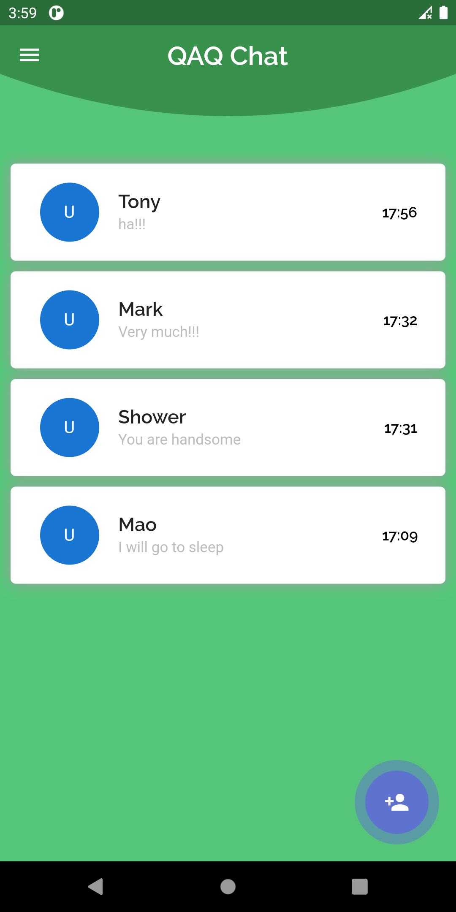
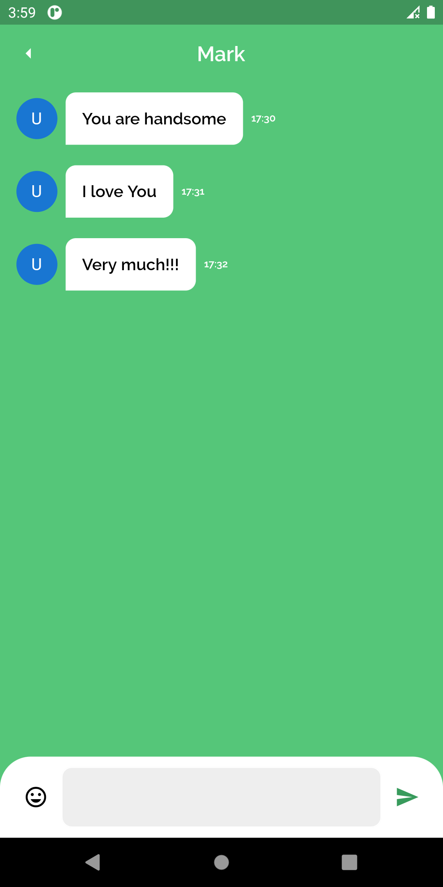

# QAQ

A chat application UI designed by flutter. Note: Just UI!!!


## 效果展示
<div align="center">




</div>

## 说明

数据模型与测试数据在`model`文件夹中

发送消息操作
```dart
//lib/ChatPage.dart
child: ChatInput(
    onPressed: (message) {
        if(message != null) {
            setState(() {
                messages.add(Message(
                sender: Data.me,
                text: message,
                time: "18:00",
                ));
            });
        }
    },
),
```
